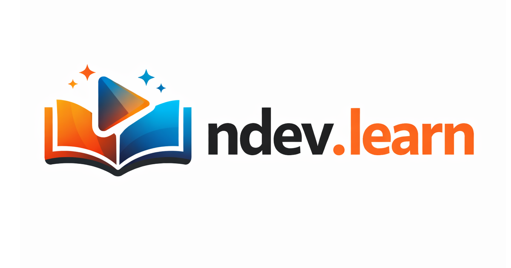
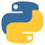
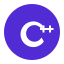
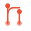

  

  <strong>Learn programming, technical skills, and creative production — for free.</strong>

  &nbsp;
  &nbsp;
  &nbsp;
  

 

## 20 courses. 3 categories. Zero to mastery.

Every course page is a **complete learning roadmap** — hand-picked resources organized from beginner to advanced so you always know exactly where to start and what comes next.

### Why ndev.learn?

- **One place, every resource** — a curated map of the best free learning materials across the internet
- **Structured for progression** — ordered beginner → advanced with a step-by-step roadmap
- **Free and open** — no paywalls, no ads, MIT licensed (accounts coming later for progress tracking)
- **Actively maintained** — new resources added, dead links removed, community contributions welcome

### Where to Start

| I want to... | Start here |
|---|---|
| Learn my first programming language | [Python](https://learn.neuman.dev/courses/python) |
| Build websites and web apps | [JavaScript & TypeScript](https://learn.neuman.dev/courses/javascript) |
| Work with data and AI | [Data Science](https://learn.neuman.dev/courses/data-science) → [AI & ML](https://learn.neuman.dev/courses/ai-ml) |
| Get a DevOps / cloud job | [Linux](https://learn.neuman.dev/courses/linux) → [Git](https://learn.neuman.dev/courses/git) → [DevOps](https://learn.neuman.dev/courses/devops) |
| Break into cybersecurity | [Linux](https://learn.neuman.dev/courses/linux) → [Cybersecurity](https://learn.neuman.dev/courses/cybersecurity) |
| Create content (video / audio / photo) | Pick your medium in [Creative Production](#creative-production) below |

> **How it works:** Pick a topic. Follow the roadmap. Each section is collapsible so you can focus on what matters to you — official docs, free interactive courses, YouTube channels, books, GitHub awesome lists, community forums, and development tools.

 

## Programming Languages

> 10 languages from web to systems to mobile — start with fundamentals, build real projects.

| | Course | What You'll Learn |
|:---:|--------|-------------------|
|  | **[Learn Python](https://learn.neuman.dev/courses/python)** | **274 projects across 13 levels** — the first active ndev.learn course |
|  | [Learn JavaScript & TypeScript](https://learn.neuman.dev/courses/javascript) | Full-stack web from vanilla JS to React and Node.js |
|  | [Learn C#](https://learn.neuman.dev/courses/csharp) | .NET, Unity, and enterprise applications |
|  | [Learn Java](https://learn.neuman.dev/courses/java) | Enterprise systems, Android, and Spring Boot |
|  | [Learn Rust](https://learn.neuman.dev/courses/rust) | Memory-safe systems programming and WebAssembly |
|  | [Learn Go](https://learn.neuman.dev/courses/go) | Cloud-native services, CLIs, and concurrent systems |
|  | [Learn Dart & Flutter](https://learn.neuman.dev/courses/dart) | Cross-platform mobile, web, and desktop apps |
|  | [Learn Swift](https://learn.neuman.dev/courses/swift) | iOS, macOS, and Apple platform development |
|  | [Learn Kotlin](https://learn.neuman.dev/courses/kotlin) | Android, multiplatform, and JVM development |
|  | [Learn PowerShell](https://learn.neuman.dev/courses/powershell) | Windows automation, scripting, and system administration |

 

## Technical Skills

> The tools and knowledge that tie everything together — databases, infrastructure, security, and AI.

| | Course | What You'll Learn |
|:---:|--------|-------------------|
|  | [Learn SQL & Databases](https://learn.neuman.dev/courses/sql) | Query, design, and optimize relational databases |
|  | [Learn Linux & Command Line](https://learn.neuman.dev/courses/linux) | Navigate, script, and administer Unix systems |
|  | [Learn Git & Version Control](https://learn.neuman.dev/courses/git) | Branch, merge, and collaborate with confidence |
|  | [Learn DevOps & Cloud](https://learn.neuman.dev/courses/devops) | Docker, CI/CD, and infrastructure as code |
|  | [Learn Data Science](https://learn.neuman.dev/courses/data-science) | Analyze, visualize, and model real-world data |
|  | [Learn AI & Machine Learning](https://learn.neuman.dev/courses/ai-ml) | Neural networks, LLMs, and intelligent applications |
|  | [Learn Cybersecurity](https://learn.neuman.dev/courses/cybersecurity) | Defend systems, find vulnerabilities, think like an attacker |

 

## Creative Production

> Go beyond code — learn to create professional video, audio, and visual content.

| | Course | What You'll Learn |
|:---:|--------|-------------------|
|  | [Learn Video Production](https://learn.neuman.dev/courses/video) | Shoot, edit, and publish professional video content |
|  | [Learn Audio Production](https://learn.neuman.dev/courses/audio) | Record, mix, and master music and podcasts |
|  | [Learn Photography & Design](https://learn.neuman.dev/courses/photography) | Capture, edit, and create stunning visual content |

 

---

 

## What's inside every course page

<table>
  <tr>
    <td width="60" align="center">🗺️</td>
    <td><strong>Learning Roadmap</strong> — Step-by-step path from beginner to mastery (opens first)</td>
  </tr>
  <tr>
    <td align="center">📖</td>
    <td><strong>Official Documentation</strong> — Primary sources and language references</td>
  </tr>
  <tr>
    <td align="center">⭐</td>
    <td><strong>GitHub Awesome Lists</strong> — Community-curated collections of the best tools and resources</td>
  </tr>
  <tr>
    <td align="center">🧪</td>
    <td><strong>Interactive Courses</strong> — Free hands-on platforms, university MOOCs, and coding challenges</td>
  </tr>
  <tr>
    <td align="center">🎬</td>
    <td><strong>Video Courses & YouTube</strong> — Structured playlists and top creator channels</td>
  </tr>
  <tr>
    <td align="center">📚</td>
    <td><strong>Books</strong> — Free online books and essential paid references</td>
  </tr>
  <tr>
    <td align="center">👥</td>
    <td><strong>Community & News</strong> — Forums, newsletters, and ecosystem resources</td>
  </tr>
  <tr>
    <td align="center">🔧</td>
    <td><strong>Tools & Environments</strong> — IDEs, playgrounds, and development tools</td>
  </tr>
</table>

 

> **Every section is collapsible.** Open what you need, skip what you don't. Resources are ordered from beginner to advanced within each section so you're never lost.

 

## What's Coming Next

This project is actively growing. Here's what's on the roadmap:

- **JavaScript & TypeScript** — the next fully active course (in development)
- **More project-based courses** — expanding depth across all 20 topics
- **Progress tracking & user accounts** — save your place, track completions
- **In-browser code editor** — practice without leaving the site

 

---

 

  

  If this helped you, consider giving it a <strong>star</strong> — it helps others find these resources too.

  MIT License — Built by <a href="https://travisjneuman.com">Travis Neuman</a> · <a href="https://learn.neuman.dev">learn.neuman.dev</a>

